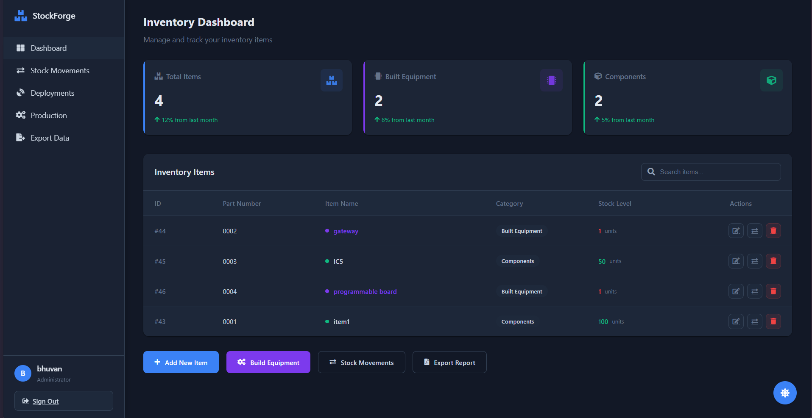

# StockForge Inventory Platform



**Enterprise Inventory Management Reimagined**  
Modern orchestration for manufacturing workflows and multi-component inventory control.

## Key Features

- **Multi-Tier Inventory Tracking**  
  Raw materials → Components → Finished goods
- **Automated Stock Reconciliation**  
  Real-time inventory adjustments across all stages
- **BOM Management**  
  Visual bill of materials builder with version control
- **Deployment Tracking**  
  Client deployment lifecycle management
- **Audit-Ready Reporting**  
  PDF/CSV exports with full transaction history

## Technology Stack

| Component               | Technology             |
|-------------------------|------------------------|
| Backend Framework       | Django 4.2             |
| Database                | PostgreSQL by Supabase |
| UI Toolkit              | SaaS Dashboard         |
| Reporting               | ReportLab + Pandas     |
| Deployment              | Docker + Nginx         |

## Quick Start with Docker

```bash
# Build and launch
docker-compose up --build -d

# Initialize system
docker-compose exec web python manage.py migrate
docker-compose exec web python manage.py createsuperuser

# Access at http://localhost:8000
```

## Core Architecture
```
├── docker-compose.yml
├── Dockerfile
├── inventory/
│ ├── models.py # Material resource planning
│ ├── views.py # Business logic core
│ └── templates/ # Enterprise UI components
├── manage.py
└── requirements.txt
```


## Enterprise Features

1. **Role-Based Access Control**  
   Granular permissions for procurement, production, and logistics teams

2. **Stock Movement API**  
   REST endpoints for ERP system integration

3. **Custom Reporting**  
   Generate compliance-ready PDF reports with:  
   - Company branding  
   - Multi-currency support  
   - Historical trend analysis

4. **Deployment Lifecycle**  
   Track equipment deployments with:  
   - Client-specific configurations  
   - Maintenance schedules  
   - Return logistics tracking

## Configuration

`env.prod` example:
```ini
DEBUG=0
SECRET_KEY=your-production-key
DB_ENGINE=django.db.backends.postgresql
DB_NAME=stockforge_prod
DB_USER=prod_admin
DB_PASSWORD=secure_password
ALLOWED_HOSTS=.yourdomain.com
```

## License

StockForge is licensed under the **Manufacturer-Friendly License (MFL)**  
See [LICENSE](LICENSE) for complete terms.

---

*Optimized for manufacturing enterprises managing 100+ SKUs across multiple facilities.*
